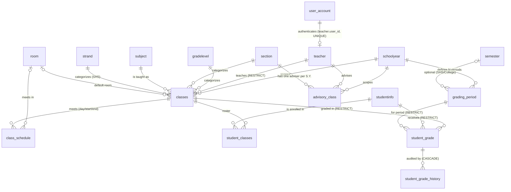

# Teacher Management & Grading Module — Architecture & Database Design

**System:** ITFA I-SMS (Ibn Taimiyah Foundation Academy)
**Author:** Architecture review, 2026-07-17
**Status:** Schema implemented & verified (`migrations/teacher_module.sql`); application layer pending
**Stack:** Procedural PHP 8 + MySQL/MariaDB (mysqli, prepared statements), Tailwind views

---

## Decisions taken (agreed before design)

| # | Question | Decision |
|---|----------|----------|
| 1 | The abandoned Laravel `lms_*` schema (39 tables) | **Ignore it.** Build on the native tables. `lms_*` left untouched. |
| 2 | 3 grading periods vs. the 4 already in the data | **Data-driven, N periods.** Periods are rows, not schema. |
| 3 | Where teacher logins live | **`user_account` + new `teacher` role** (already bcrypt), linked via `teacher.user_id`. |

---

## 1. Assessment of the current structure

### 1.1 A second grading system already exists (and is abandoned)
The database contains **39 `lms_*` tables** — a complete Laravel LMS with its own users, courses, terms, gradebook, and grade releases, plus 4 views (`v_lms_teachers`, `v_lms_classes`, `v_lms_class_roster`, `v_lms_legacy_grades`).

It is **populated but unused**: 1,746 users imported (all 112 teachers linked to `teacher.Teacher_id`, Argon2id-hashed), 489 courses — but **1 gradebook entry, 0 assignments, 0 submissions, 0 materials, 0 grade components, 0 releases**. **No PHP file in this codebase references any `lms_` table.**

> **Verdict:** it is a parallel application, not part of this system. Building a third grading system would be indefensible. Decision: build native; leave `lms_*` alone pending a decommissioning decision.

### 1.2 The live `grade` table cannot satisfy the requirements
`grade` holds **15,447 real rows** (all S.Y. 2023-2024). Defects:

| Defect | Detail | Requirement broken |
|---|---|---|
| `grade` is `int(11)` | **85.75 cannot be stored.** | Grading (decimal grades) |
| `gradeperiod_id` is `varchar(11)` | Stores `'1st'`…`'4th'`, but `gradingperiod.gradeperiod_id` is `int` 1–4 → **type mismatch, so the FK cannot exist**. The tables are silently unrelated. | 3NF / referential integrity |
| `date_entered` is `varchar(255)` | Mixed formats: `2023-11-10` **and** `2023-11-20 20:54:03`. | Timestamps |
| No `UNIQUE` key | Nothing prevents two grades for the same student+class+period. | "Prevent duplicate grade entries" |
| No `created_by`/`updated_by` | No actor recorded, ever. | Grade History (#6) |
| No lock flag | Registrar cannot lock/reopen. | Grading (#5) |
| **Broken FK** | `grade.student_id` → **`student_classes.student_id`**, a *non-unique* junction column (27,927 rows / 2,154 distinct). Semantically wrong. | 3NF |

**Data integrity was verified as clean**: 15,447 rows, **0 orphans** — every `student_id` resolves to `studentinfo.student_id` and every `Class_id` to a class. The FK simply pointed at the wrong table; the values were always right. Migration was therefore safe.

### 1.3 Teachers cannot log in at all
- **No `Teacher` role exists.** `user_account` has `user` / `super admin`; `enrollment_users` has `Admission/Enrollment/Cashier/Registrar/Admin`.
- `teacher.Password` is **plaintext, 5 characters** (95 of 112 populated) and unused by any login page — a dead, dangerous field.
- `teacher` violates 3NF: `Fullname` is derivable from `Firstname`/`Middlename`/`Lastname`.

### 1.4 Cascade rules risked catastrophic loss
`classes.Teacher_id → teacher` was **`ON DELETE CASCADE`**, and `grade.Class_id → classes` is **`ON DELETE CASCADE`**. **Deleting one teacher would silently delete their classes and every grade in them.**

### 1.5 Structural gaps
- `classes.Time` is free text (`'1:00 -2:00'`, `'8:30 -9:30'`) — no day, no structure, no conflict detection.
- **No room on `classes`.** The `room` table exists but is **empty and has no PRIMARY KEY**.
- **No advisory-class concept** anywhere.
- `announcements` (8 rows) keyed by a bare `username` string; no title, audience, or author FK.
- `classes.Status` is `int`; all 669 rows are `1` — meaningless.
- Live scale: **489 classes / 64 teachers** in the active S.Y. 2026-2027.

### 1.6 Policy vs. data conflict
Spec says three grading periods; **the 4th grading period already holds 650 rows** (S.Y. 2023-2024). Resolved by modelling periods as data.

---

## 2. Recommended normalized schema (3NF)

### 2.1 Change summary

| Table | Action | Why |
|---|---|---|
| `room` | **Modified** | Had **no primary key**. Added PK + auto_increment + `status`. |
| `grading_period` | **Added** | Replaces the context-free global `gradingperiod`. N periods **per school year**, each independently Open/Closed/**Locked**. |
| `teacher` | **Modified** | `user_id` → `user_account` (UNIQUE), `employee_no`, `email`, `contact`, `status`, timestamps. |
| `classes` | **Modified** | `class_status` (Open/Closed), `room_id`, timestamps, **cascade fixed to RESTRICT**. |
| `advisory_class` | **Added** | One adviser per section per S.Y. (dashboard requirement). |
| `class_schedule` | **Added** | Normalizes `classes.Time` into day/start/end/room. |
| `student_grade` | **Added** | The grade record. Replaces `grade`. |
| `student_grade_history` | **Added** | Full audit trail (#6). |
| `announcements` | **Modified** | `title`, `audience`, `author_user_id`, `is_published`, `school_year_id`. |
| `student_grades` | **Removed** | Empty placeholder that violated **1NF** (`q1..q4` = repeating group). Drop is guarded by a row-count check. |
| `grade` | **Retained, read-only** | Historical backup. Never altered — same pattern as `back_accounts`. |
| `gradingperiod` | **Retained, read-only** | Legacy lookup; superseded by `grading_period`. |
| `lms_*` (39 tables) | **Untouched** | Out of scope by decision. |

### 2.2 Why `student_grade` is 3NF

- **1NF** — one atomic grade per row. No `q1..q4` repeating groups: *(class, student, period)* is one fact in one row. Adding a 4th period is an INSERT into `grading_period`, not a schema change.
- **2NF** — every non-key attribute depends on the whole key *(class_id, student_id, grading_period_id)*. Subject, section, grade level, S.Y. and teacher are **not** duplicated here; they belong to `classes`.
- **3NF** — no transitive dependencies. `student_grade` stores no student name, no subject name, no teacher name. School year reaches a grade only through `classes → schoolyear` and `grading_period → schoolyear`.

**One deliberate exception:** `student_grade_history` is **intentionally denormalized** (`changed_by_name`, `class_id`, `student_id` copied in). An audit trail must remain truthful even if a user is renamed or a lookup row changes. Audit tables record *what was true at the time*; that is not a normalization defect.

**One accepted legacy wart:** `teacher.Fullname` is a transitive dependency and *should* be dropped. It is **retained** because the legacy name data is dirty (e.g. `Lastname = 'Kaminon,LPT'`), so regenerating it would corrupt display names. The application must treat `Firstname/Middlename/Lastname` as the source of truth. Cleaning this is a data task, not a schema task.

### 2.3 Keys, constraints, indexes

**`grading_period`**
- PK `id`; **UNIQUE `(school_year_id, term_no)`** — a school year cannot have two "2nd Grading".
- FK `school_year_id` → `schoolyear` **CASCADE**; `semester_id` → `semester` **SET NULL** (ready for semester-based terms).
- Indexes: `status`, `is_current`, `semester_id`.

**`student_grade`** — the core table
- PK `id` (BIGINT — grades outgrow INT: 489 classes × ~40 students × 3 periods × N years).
- **UNIQUE `(class_id, student_id, grading_period_id)`** ← *this is the database-level guarantee behind "only one grade per grading period per student per subject".* A class already encodes subject + section + S.Y. + teacher, so this key is exactly that rule.
- FKs all **RESTRICT**: `class_id` → `classes`, `student_id` → **`studentinfo`** (the PK — fixing the broken FK), `grading_period_id` → `grading_period`.
- `CHECK (grade IS NULL OR grade BETWEEN 0 AND 100)`.
- `grade` is **NULLable** — NULL means *not yet encoded*, which is different from 0. The old `int` column could not express that distinction.
- Indexes: `student_id`, `grading_period_id`, `status`, and composite `(class_id, grading_period_id)` — the exact shape of the class-roster query.

**`student_grade_history`**
- FK `student_grade_id` → `student_grade` **CASCADE** (policy: rows are never hard-deleted).
- Indexes: `student_grade_id`, `student_id`, `changed_at`, `changed_by`.

**`advisory_class`** — **UNIQUE `(school_year_id, section_id)`**; `teacher_id` **RESTRICT**.
**`class_schedule`** — **UNIQUE `(class_id, day_of_week, start_time)`**; indexes `(day_of_week, start_time)` and `(room_id, day_of_week)` for conflict detection.
**`teacher`** — **UNIQUE `user_id`**, **UNIQUE `employee_no`**; `user_id` → `user_account` **SET NULL**.

### 2.4 Cascade policy

| Rule | Reason |
|---|---|
| `classes.Teacher_id` → **RESTRICT** *(was CASCADE)* | **Deleting a teacher must never delete grades.** Reassign the class instead. |
| `student_grade.*` → **RESTRICT** | A grade is a legal record. It must never vanish as a side effect. |
| `grading_period.school_year_id` → CASCADE | Periods are owned by their school year and meaningless without it. |
| `student_grade_history` → CASCADE | Bound to its parent; parents are never deleted. |
| `class_schedule.class_id` → CASCADE | A meeting time has no meaning without its class. |

> **Verified:** after migration, `DELETE FROM teacher …` and `DELETE FROM classes …` are both **blocked** by the database.

---

## 3. Entity Relationship Diagram



### Reading the diagram

The design turns on **`classes` as the unit of authorization** and **`student_grade` as the unit of record**.

- **`classes` is the pivot.** One row = *this subject, for this section, at this grade level, in this school year, taught by this teacher*. Every teacher permission check reduces to a single question: **does `classes.Teacher_id` match the logged-in teacher?** That is why requirement #3 ("teachers only see their assigned classes") needs no extra permission table — the assignment *is* the class row.
- **The roster comes from `student_classes`**, not from grades. A student appears in a class because they are enrolled in it; grades are recorded *against* that fact. This is what satisfies "the class list must only include officially enrolled students in that subject."
- **`student_grade` is the intersection of three things**: a class, a student, and a period. That triple is its UNIQUE key, and it is exactly the business rule.
- **School year is never stored on a grade.** It is reachable two ways — `classes → schoolyear` and `grading_period → schoolyear` — which is why the migration joins on **both** and requires them to agree. Storing `school_year_id` on `student_grade` would be a transitive dependency and would allow the two paths to disagree.
- **`grading_period` hangs off `schoolyear`, not off nothing.** That single change is what makes locking, reopening, 4-period years, and semester terms all possible without schema edits.

---

## 4. SQL implementation

Delivered and executed: **`migrations/teacher_module.sql`** (idempotent, portable MySQL 5.7/8.x + MariaDB 10.x).

**Verified results:**

| Check | Result |
|---|---|
| Migration runs / re-runs | **Stable across 3 runs** (no-op after the first) |
| Legacy `grade` → `student_grade` | **15,447 → 15,447**, and **15,447 audit rows** seeded |
| Grade fidelity vs. legacy | **15,447 exact matches, 0 mismatched** |
| Periods seeded (data-driven) | S.Y. 2023-2024 → **4** (its data needed it); 2024-25, 2025-26, 2026-27 → **3** |
| Current period | S.Y. 2026-2027 · First Grading · Open |
| Duplicate grade insert | **Rejected by UNIQUE key** |
| `85.75` | **Stored** (impossible before) |
| `grade = 150` | **Rejected by CHECK** |
| `DELETE FROM teacher` | **Blocked** — grades safe |
| `DELETE FROM classes` (with grades) | **Blocked** |
| `grade`, `gradingperiod`, `lms_*` | **Untouched** |

---

## 5. Grading workflow — teacher login to submission

```
 1. LOGIN            login.php → authenticate_user() → user_account (bcrypt)
                     role = 'teacher'  →  user_home_path() → teacher/index.php

 2. IDENTITY         teacher_service: resolve teacher.Teacher_id FROM teacher WHERE user_id = <session user_id>
                     No Teacher_id  →  hard stop. A staff account can never "become" a teacher.

 3. DASHBOARD        teacher/index.php
                     profile · advisory (advisory_class) · load (classes) · schedule (class_schedule)
                     · students per class (student_classes) · active S.Y. · current period
                       (grading_period WHERE is_current=1) · announcements (audience IN ('All','Teacher'))

 4. MY CLASSES       teacher/classes.php
                     SELECT … FROM classes WHERE Teacher_id = :me AND School_year_id = :activeSY
                     ── the ONLY source of the teacher's class list ──

 5. CLASS ROSTER     teacher/class_view.php?class_id=N
                     ① AUTHORIZE FIRST: class_id must belong to :me — else 403. Never trust the URL.
                     ② Roster: student_classes JOIN studentinfo WHERE class_id = N
                     ③ Existing grades: LEFT JOIN student_grade ON (class, student, :period)

 6. ENCODE           teacher/grade_encode.php  (POST)
                     Server-side gate, in order:
                       a. CSRF token valid                     → else reject
                       b. class belongs to :me                 → else 403
                       c. classes.class_status = 'Open'        → else reject
                       d. grading_period.status = 'Open'       → else reject ("locked by Registrar")
                       e. student is on THIS class roster      → else reject
                       f. 0 ≤ grade ≤ 100 (or NULL)            → else reject
                     Then: INSERT … ON DUPLICATE KEY UPDATE   ← the UNIQUE key makes this atomic
                           + write student_grade_history (old → new, actor, IP, UA)
                     All inside ONE transaction.

 7. SUBMIT           status Draft → Submitted (teacher attests the period is complete)

 8. LOCK             Registrar/Admin: grading_period.status → 'Locked'
                     Teachers can no longer edit. Reopen = status → 'Open' (audited).
```

**Why the order in step 6 matters:** authorization is checked **before** validation, and both happen **before** any write. The class-ownership check (b) is the single line that satisfies "teachers cannot grade students outside their assigned classes" — and it is a **server-side** check keyed off the *session*, never off a form field.

**Why `INSERT … ON DUPLICATE KEY UPDATE`:** a "check then insert" would race — two tabs could both pass the check and both insert. The UNIQUE key makes the database itself the arbiter, so duplicates are impossible even under concurrency. This is the same reasoning as the SOA `document_series` fix.

---

## 6. Application architecture (MVC, adapted honestly)

This codebase is **not** MVC and should not pretend to be. It is **procedural page-controllers + a service layer**, and it is consistent — `includes/soa_service.php`, `promissory_service.php`, `back_account_service.php`, `registrar_service.php`. The Teacher Module must match that, or it becomes a foreign body no one maintains.

The existing pattern already separates the three concerns MVC cares about:

| MVC role | Here | Rule |
|---|---|---|
| **Model / Service** | `includes/teacher_service.php`, `includes/grading_service.php` | All SQL and business rules. **No HTML.** Reusable and unit-testable. |
| **Controller** | Top of each `teacher/*.php` (guard → POST handling → data fetch → redirect) | **No SQL.** Calls services only. |
| **View** | Bottom of each `teacher/*.php` (Tailwind) + `teacher/sidebar.php` | **No business logic.** Escapes everything with `h()`. |

### Files to build

```
includes/teacher_auth.php         require_teacher_login(): session + role + Teacher_id resolution
includes/teacher_service.php      teacher_profile, teacher_classes, teacher_advisory,
                                  teacher_schedule, teacher_owns_class  ← the authorization primitive
includes/grading_service.php      gp_current, gp_for_sy, grade_roster, grade_save,
                                  grade_bulk_save, grade_lock, grade_history, grade_audit

teacher/index.php                 Dashboard
teacher/classes.php               My Classes
teacher/class_view.php            Roster + encode grid
teacher/grade_encode.php          POST endpoint
teacher/grade_history.php         Per-student audit view
teacher/schedule.php              Weekly schedule
teacher/sidebar.php               Nav

registrar/grading_periods.php     Open / Close / Lock / Reopen  (Registrar + Super Admin)
```

### Reuse, don't reinvent
Add to `includes/functions.php`, mirroring the existing helpers:
```php
function is_teacher_user(?array $user = null): bool   // role === 'teacher'
```
and extend `user_home_path()` → `teacher/index.php`. `login.php`, `authenticate_user()`, CSRF, and `h()` need **no changes** — that is the point of using `user_account`.

---

## 7. Security (requirement #8)

| Control | Implementation |
|---|---|
| **RBAC** | `require_login()` + `is_teacher_user()` at the top of every `teacher/*.php`, matching the cashier/registrar pattern audited earlier. |
| **Permission validation** | `teacher_owns_class($db, $classId, $teacherId)` — **every** class-scoped page and POST calls it before anything else. Ownership derives from `classes.Teacher_id`, resolved from the **session**, never from input. |
| **Server-side validation** | Range 0–100, period Open, class Open, student on roster — enforced in `grading_service`, *and* by DB constraints (UNIQUE + CHECK + FK) as defence in depth. |
| **CSRF** | `verify_csrf_token($_POST['csrf_token'])` on every POST — the codebase is already 100% compliant here; do not break the streak. |
| **SQL injection** | mysqli prepared statements only. Never interpolate `$_GET['class_id']` — cast with `to_int()` and bind. |
| **Input sanitization** | `to_int()` / `(float)` on entry; `h()` on **every** output. |
| **Session validation** | Re-resolve the teacher from the DB on each request (as `require_student_login()` does) so a deactivated teacher loses access immediately — never trust cached session claims. |

**Teachers must never reach** other teachers' classes (blocked by `teacher_owns_class`), or the admin / registrar / finance modules (blocked because those pages check `is_cashier_user` / `is_registrar_user` / `is_super_admin`, which a `teacher` role never satisfies).

### Outstanding security debt (from the security review, now relevant)
1. **`teacher.Password` is plaintext (95/112).** It is currently a dead field. **Drop it** once accounts are provisioned in `user_account`. Left in place by this migration deliberately — dropping it before provisioning would destroy the only record of those accounts.
2. Teacher accounts must be provisioned with **bcrypt** + `must_change_password` on first login (mirror the student portal).
3. `enrollment_users` plaintext passwords remain unfixed — unchanged by this work, still outstanding.

---

## 8. Scalability, performance, maintainability

### Built in already
| Future requirement | Why it already works |
|---|---|
| **4 grading periods** | `INSERT` a `term_no = 4` row. Already proven: S.Y. 2023-2024 has 4. |
| **Semester-based grading** | `grading_period.semester_id` is present and FK'd. |
| **Multiple school years** | Every period, class and advisory is S.Y.-scoped. |
| **SHS strands** | `classes.strand_id` exists. |
| **Grade locking / reopening** | `grading_period.status` + `student_grade.status`/`locked_by`/`locked_at`. |
| **Approval workflow** | `student_grade.status` (Draft → Submitted → Locked) is the state machine's seam. |
| **Report cards** | One indexed query: `student_grade` × `grading_period` × `classes` for a student. |
| **Grade history** | `student_grade_history` from day one. |

### Requires additive work (no redesign)
| Requirement | Approach |
|---|---|
| **Multiple campuses** | Add `campus` + `campus_id` on `schoolyear`/`classes`; scope queries. No table splits. |
| **College departments** | Extend the `gradelevel`/`strand` dimension; `classes` is already generic. |
| **OBE / computed grades** | Add `grade_component` (per class: written work %, performance %, exam %) + `student_grade_component`. `student_grade.grade` becomes the *computed* result; components are the inputs. Deliberately **not** built now — no requirement yet, and it would be speculative. |

### Performance
- Composite `(class_id, grading_period_id)` on `student_grade` matches the roster query exactly.
- `(Teacher_id, School_year_id)` on `classes` matches the "my classes" query exactly.
- BIGINT PK on `student_grade`: at 489 classes × ~40 students × 3 periods ≈ **59k rows/year**, INT would last a long time — but grade tables are append-only and never pruned, and widening a PK later is an outage. This is cheap insurance.
- **Precedent to heed:** the back-account student picker took **4.8s/keystroke** purely from missing indexes and a `CAST()` in a join. `migrations/student_search_indexes.sql` fixed it (→8ms). **Never join `enrollment` to profile tables via `CAST()`.**

### Maintainability
1. **One grading system.** The `lms_*` tables are the cautionary tale — a half-built parallel system that cost storage, confusion, and review time while delivering one gradebook entry. Decide its fate deliberately.
2. **`grade` and `gradingperiod` are now read-only history.** Same contract as `back_accounts`: never write to them again.
3. **The two SOA slip renderers already drifted** (`cashier/soa.php` mirrors `includes/soa_slip.php` and silently lacks the promissory warning). Do not repeat that here: the grade grid must live in **one** partial included by both the teacher and registrar views.
4. **Code changes forced by this migration — APPLIED & VERIFIED.**
   Dropping the `student_grades` placeholder broke live code. Caught during verification and fixed:
   - `includes/registrar_service.php` — **was fatal**: `registrar_drop_preview()` queried `FROM student_grades`, a table this migration drops, so the Registrar's student-drop screen would have thrown *"Table doesn't exist"* on load. Now counts `student_grade` (keyed by `studentinfo`, not `enrollment_id` — grades hang off classes, not enrolments).
   - `includes/registrar_service.php` — **drop order**: `student_grade.student_id → studentinfo` is RESTRICT, so `DELETE FROM studentinfo` would fail for any graded student. Grades are now deleted explicitly *before* `studentinfo` (history cascades).
   - `registrar/student_records.php` — preview label repointed.
   - `student/grades.php` — placeholder copy now describes the normalized `student_grade`/`grading_period` model instead of the 1NF-violating `q1..q4` stub.

   *Verified:* `registrar_drop_preview()` runs clean and reports a `student_grade` count; all three files lint clean.

> **Lesson worth keeping:** the RESTRICT rule is the *correct* trade — grades must not vanish as a side effect of dropping a student — but it converts a silent cascade into a loud failure. That is the point, and it is why the drop tool must delete grades deliberately rather than inherit them through a cascade.

---

## Deployment order

| # | Step | Status |
|---|------|--------|
| 1 | `migrations/teacher_module.sql` | ✅ **Applied locally & verified** (idempotent — safe online) |
| 2 | `includes/registrar_service.php`, `registrar/student_records.php`, `student/grades.php` | ✅ **Fixed** — must upload **with** the migration (see §8.4) |
| 3 | Provision teacher accounts in `user_account` (role `teacher`, bcrypt, `must_change_password=1`); set `teacher.user_id` | ⬜ Next |
| 4 | Build the application layer (§6) | ⬜ Next |
| 5 | `ALTER TABLE teacher DROP COLUMN Password` — only after step 3 is confirmed | ⬜ After 3 |

> **Ordering constraint:** steps 1 and 2 ship **together**. The migration drops `student_grades`; the old `registrar_service.php` reads it. Deploying the migration alone takes the Registrar's student-drop screen down.
